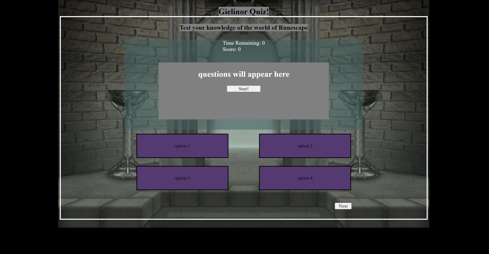

# Gielinor-Quiz
A quiz about the beloved world of Gielinor from the MMORPG Runescape! Built using JavaScript, HTML, and CSS.

I used JavaScript for the logic of the game. First I made the questions into objects that contain the question, 4 answers and a boolean value of true or false depending on if the answer was the right answer or not. Then I added all of these objects to an array and randomized them. When the start button is clicked, the timer starts ticking down and a question with 4 choices is presented. 

If you choose the correct answer then you are rewarded with 100 points and it moves to the next question. If you are wrong the game subtracts 5 seconds from the clock and you are awarded 0 points. At the end of 10 questions your points are displayed and you are prompted for a name to add to the highscores list. 

I have yet to code out the highscore list so that people can view their past attempts but hope to have that done soon.

Besides some errors that show up due to chrome extensions it should load without any errors in the console.

ScreenShot of game!

Link to live application: https://bram-g.github.io/Gielinor-Quiz/